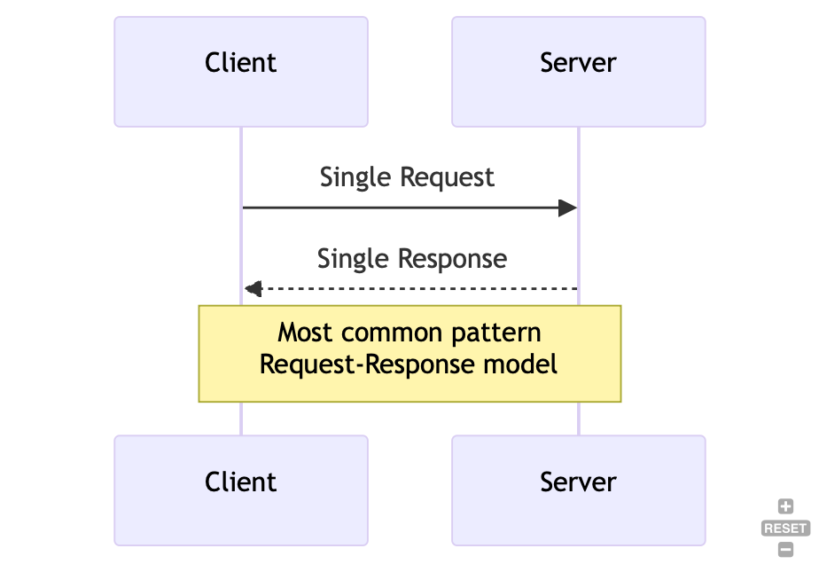
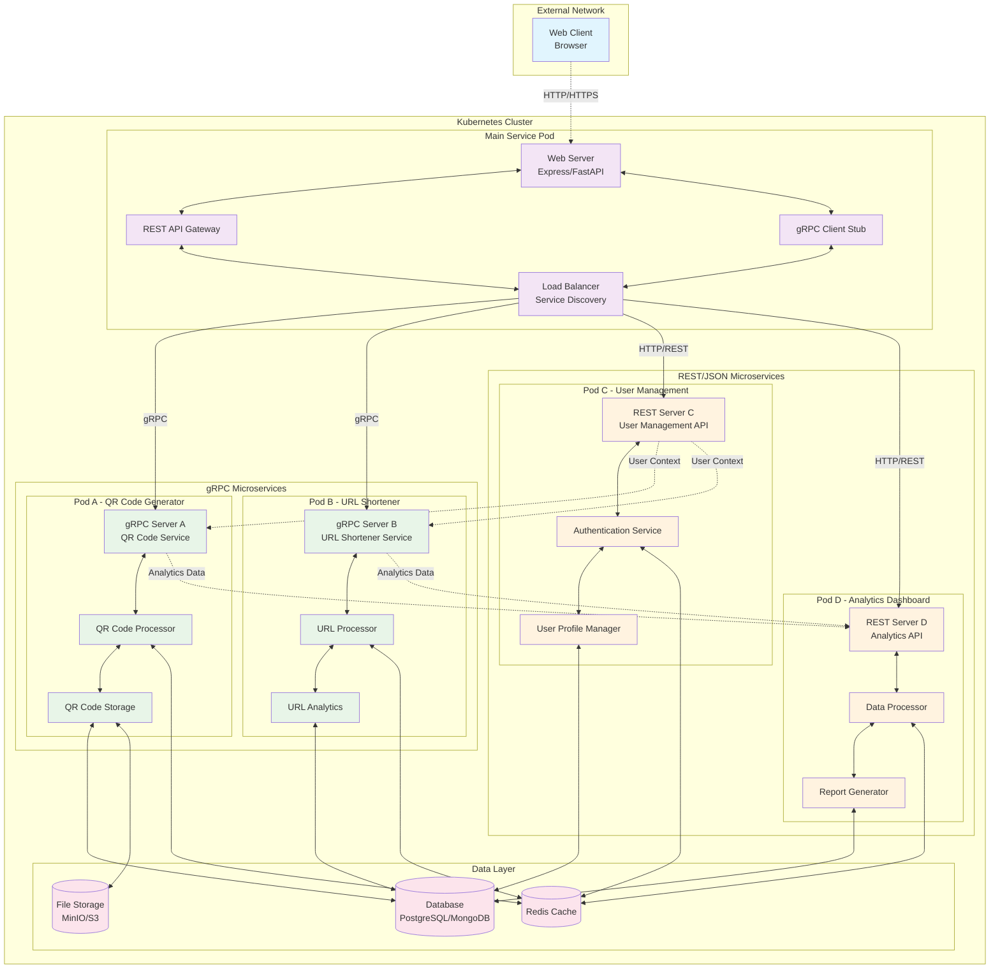

# Extended Architecture - 4 Microservices (2 REST + 2 gRPC)

## Service Breakdown

### Main Service (Gateway)
- **Web Server**: Frontend interface and HTTP handling
- **REST API Gateway**: Routes REST requests to appropriate services
- **gRPC Client Stub**: Handles gRPC communication
- **Load Balancer**: Service discovery and request distribution

### gRPC Microservices (Protocol Buffers)

#### Service A - QR Code Generator
- **Port**: 50051
- **Protocol**: gRPC/HTTP2
- **Features**: QR code generation, format conversion, batch processing
- **Data**: Stores generated QR codes and metadata

#### Service B - URL Shortener
- **Port**: 50052
- **Protocol**: gRPC/HTTP2
- **Features**: URL shortening, redirect handling, click tracking
- **Data**: URL mappings and analytics

### REST/JSON Microservices

#### Service C - User Management
- **Port**: 8080
- **Protocol**: REST/HTTP
- **Features**: User authentication, profile management, permissions
- **Data**: User accounts, sessions, preferences

#### Service D - Analytics Dashboard
- **Port**: 8081
- **Protocol**: REST/HTTP
- **Features**: Data aggregation, reporting, dashboard APIs
- **Data**: Analytics data, reports, metrics

## Communication Patterns

### gRPC Communication
- Unary RPCs for simple request-response
- Server streaming for real-time updates
- Client streaming for batch operations
- Bidirectional streaming for interactive features

### REST Communication
- Standard HTTP methods (GET, POST, PUT, DELETE)
- JSON payload format
- RESTful resource-based URLs
- Standard HTTP status codes