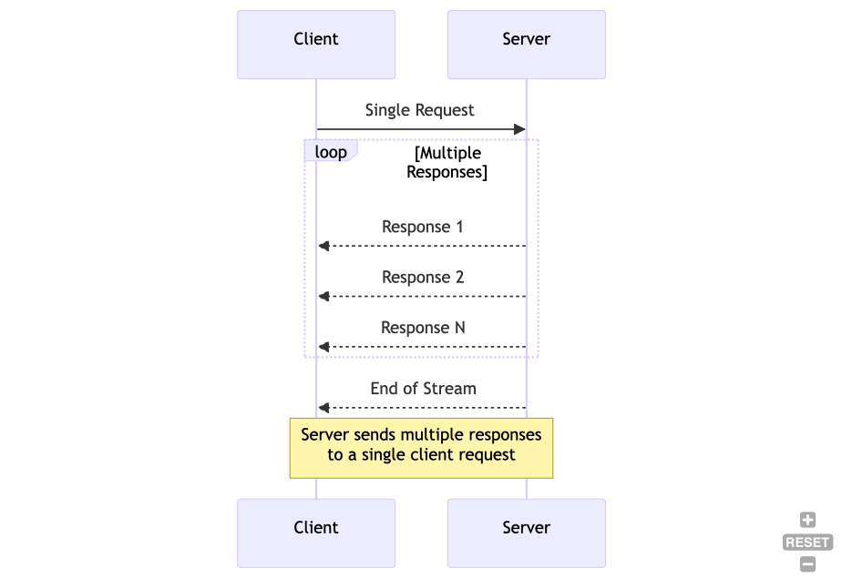
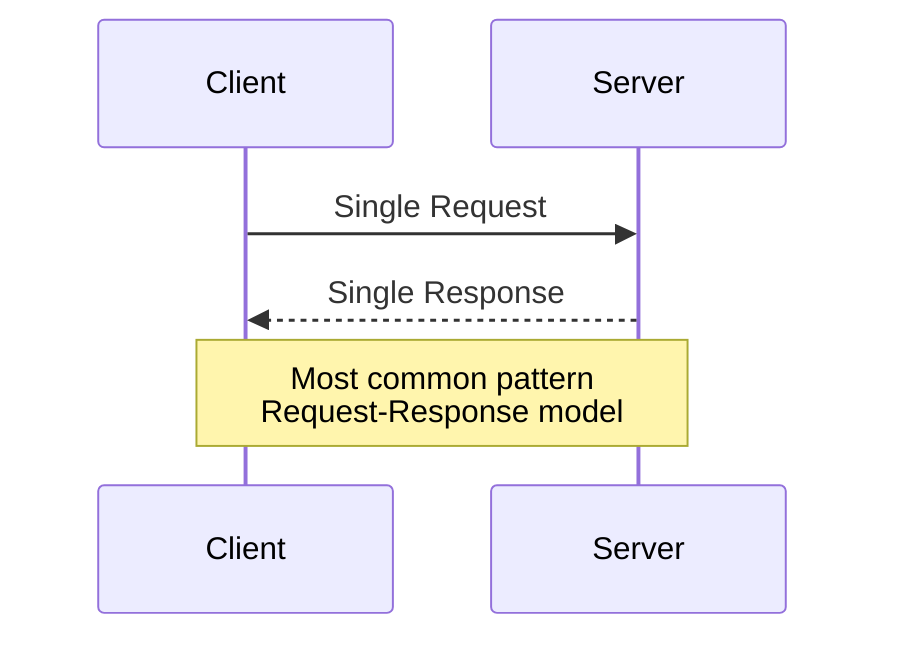
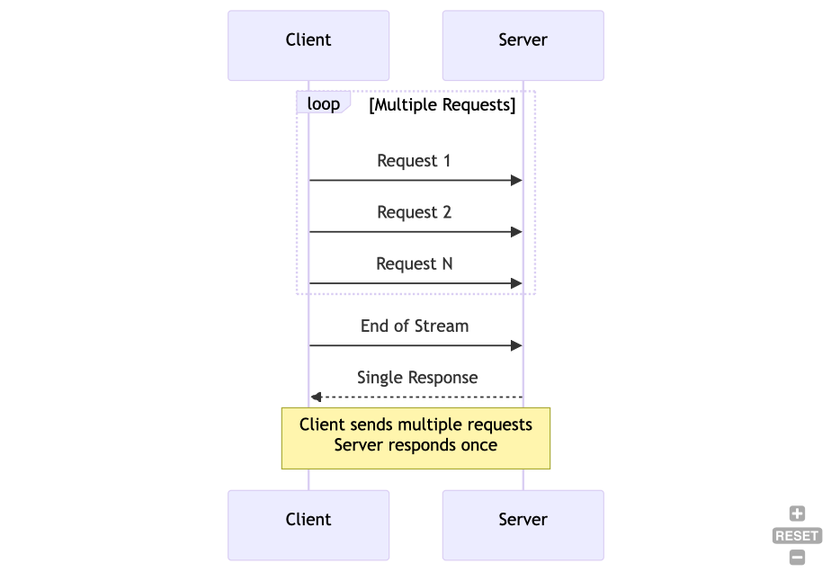
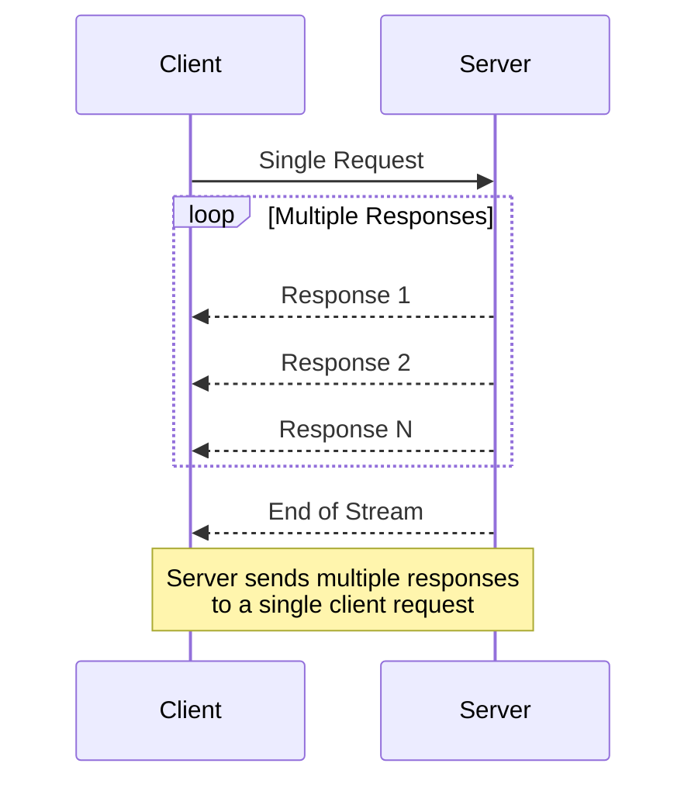
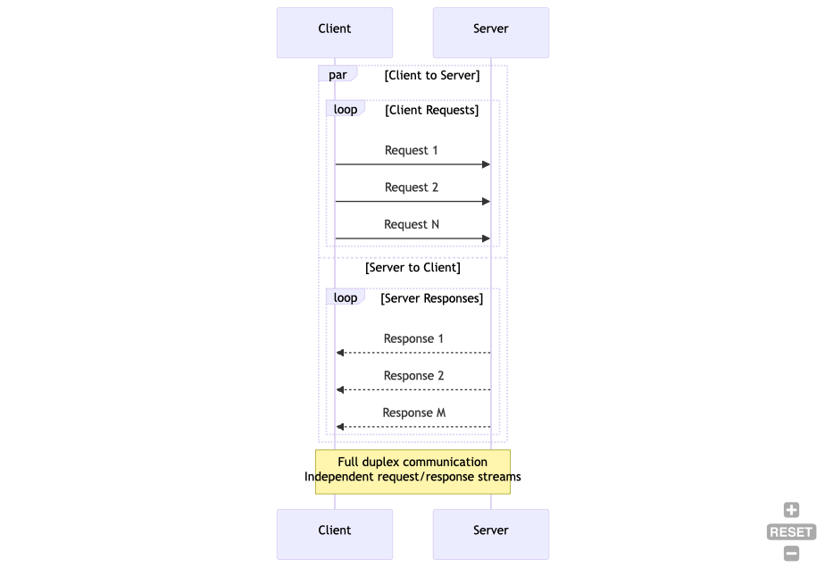
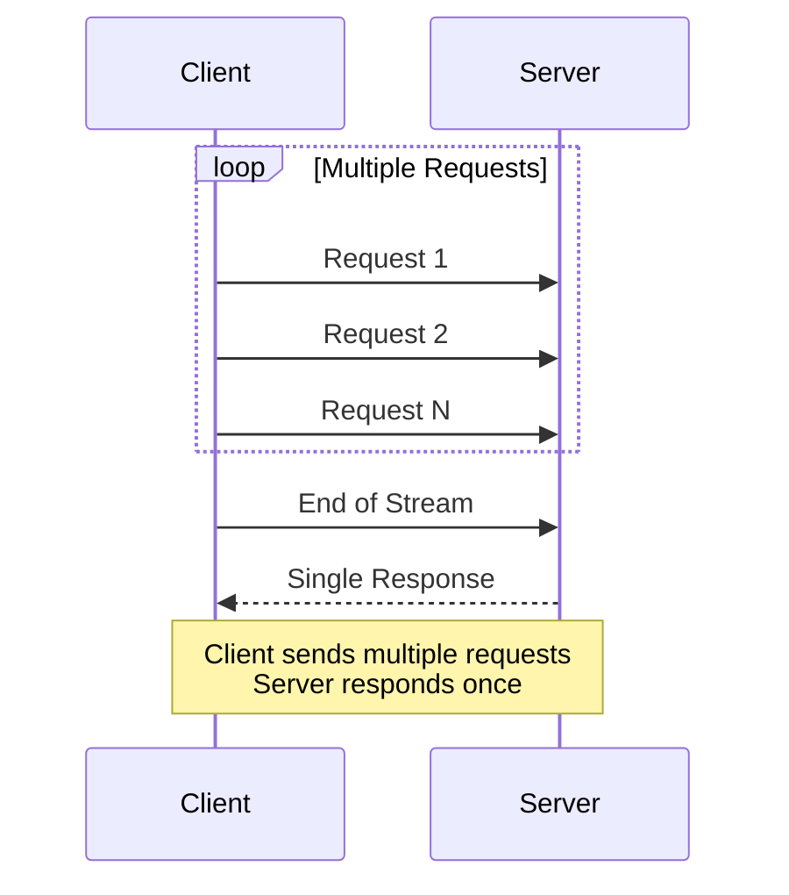
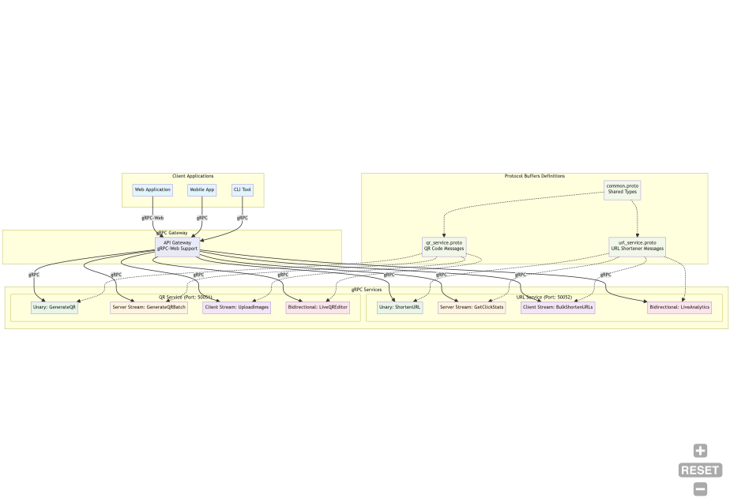
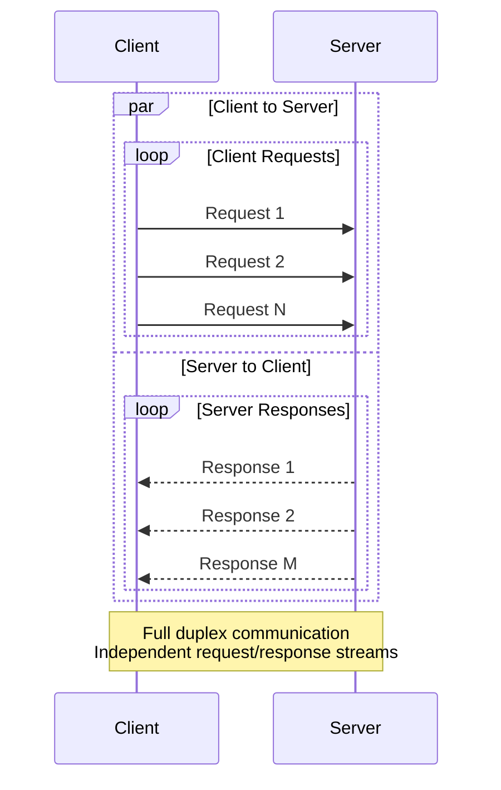
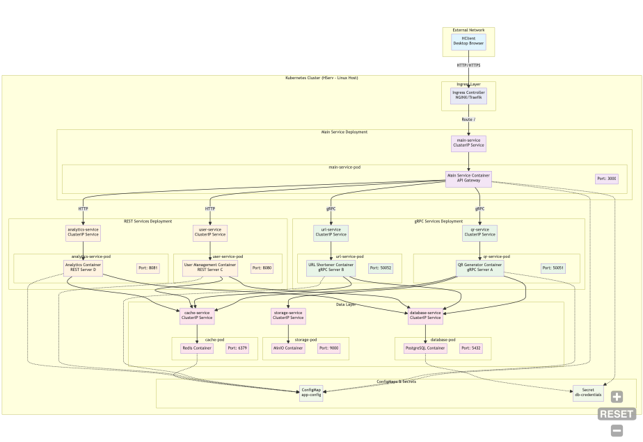

# gRPC Communication Patterns

## 1. Unary RPC Pattern





### Use Cases
- Simple CRUD operations
- Authentication requests
- Single QR code generation
- URL shortening requests

## 2. Server Streaming RPC Pattern





### Use Cases
- Real-time analytics data
- Live QR code generation progress
- Streaming click statistics
- Live user activity feeds

## 3. Client Streaming RPC Pattern





### Use Cases
- Batch QR code generation
- Bulk URL shortening
- File upload streaming
- Batch analytics data submission

## 4. Bidirectional Streaming RPC Pattern





### Use Cases
- Real-time chat features
- Live collaboration on QR codes
- Interactive analytics dashboard
- Live monitoring and alerts

## Complete gRPC Service Architecture

```mermaid
graph TB
    subgraph "Client Applications"
        WebApp[Web Application]
        MobileApp[Mobile App]
        CLITool[CLI Tool]
    end

    subgraph "gRPC Gateway"
        Gateway[API Gateway<br/>gRPC-Web Support]
    end

    subgraph "gRPC Services"
        subgraph "QR Service (Port: 50051)"
            QRUnary[Unary: GenerateQR]
            QRServerStream[Server Stream: GenerateQRBatch]
            QRClientStream[Client Stream: UploadImages]
            QRBidirectional[Bidirectional: LiveQREditor]
        end

        subgraph "URL Service (Port: 50052)"
            URLUnary[Unary: ShortenURL]
            URLServerStream[Server Stream: GetClickStats]
            URLClientStream[Client Stream: BulkShortenURLs]
            URLBidirectional[Bidirectional: LiveAnalytics]
        end
    end

    subgraph "Protocol Buffers Definitions"
        QRProto[qr_service.proto<br/>QR Code Messages]
        URLProto[url_service.proto<br/>URL Shortener Messages]
        CommonProto[common.proto<br/>Shared Types]
    end

    %% Client connections
    WebApp -->|gRPC-Web| Gateway
    MobileApp -->|gRPC| Gateway
    CLITool -->|gRPC| Gateway

    %% Gateway to services
    Gateway -->|gRPC| QRUnary
    Gateway -->|gRPC| QRServerStream
    Gateway -->|gRPC| QRClientStream
    Gateway -->|gRPC| QRBidirectional

    Gateway -->|gRPC| URLUnary
    Gateway -->|gRPC| URLServerStream
    Gateway -->|gRPC| URLClientStream
    Gateway -->|gRPC| URLBidirectional

    %% Proto file relationships
    QRProto -.-> QRUnary
    QRProto -.-> QRServerStream
    QRProto -.-> QRClientStream
    QRProto -.-> QRBidirectional

    URLProto -.-> URLUnary
    URLProto -.-> URLServerStream
    URLProto -.-> URLClientStream
    URLProto -.-> URLBidirectional

    CommonProto -.-> QRProto
    CommonProto -.-> URLProto

    %% Styling
    classDef client fill:#e1f5fe
    classDef gateway fill:#e8eaf6
    classDef unary fill:#e8f5e8
    classDef serverStream fill:#fff3e0
    classDef clientStream fill:#f3e5f5
    classDef bidirectional fill:#fce4ec
    classDef proto fill:#f1f8e9

    class WebApp,MobileApp,CLITool client
    class Gateway gateway
    class QRUnary,URLUnary unary
    class QRServerStream,URLServerStream serverStream
    class QRClientStream,URLClientStream clientStream
    class QRBidirectional,URLBidirectional bidirectional
    class QRProto,URLProto,CommonProto proto
```





## Protocol Buffers Message Examples

### Common Types
```protobuf
// common.proto
syntax = "proto3";

package common;

message ErrorResponse {
    int32 code = 1;
    string message = 2;
    string details = 3;
}

message Timestamp {
    int64 seconds = 1;
    int32 nanos = 2;
}

message PaginationRequest {
    int32 page = 1;
    int32 size = 2;
}
```

### QR Service Messages
```protobuf
// qr_service.proto
syntax = "proto3";

import "common.proto";

package qr_service;

// Unary RPC Messages
message GenerateQRRequest {
    string data = 1;
    QRFormat format = 2;
    int32 size = 3;
}

message GenerateQRResponse {
    bytes qr_image = 1;
    string qr_id = 2;
    common.Timestamp created_at = 3;
}

// Server Streaming Messages
message QRBatchRequest {
    repeated string data_items = 1;
    QRFormat format = 2;
}

message QRBatchResponse {
    string qr_id = 1;
    bytes qr_image = 2;
    int32 progress = 3;
    bool completed = 4;
}

enum QRFormat {
    PNG = 0;
    SVG = 1;
    PDF = 2;
}
```

### URL Service Messages
```protobuf
// url_service.proto
syntax = "proto3";

import "common.proto";

package url_service;

// Unary RPC Messages
message ShortenURLRequest {
    string original_url = 1;
    string custom_alias = 2;
    common.Timestamp expires_at = 3;
}

message ShortenURLResponse {
    string short_url = 1;
    string url_id = 2;
    common.Timestamp created_at = 3;
}

// Server Streaming Messages
message ClickStatsRequest {
    string url_id = 1;
    common.Timestamp start_date = 2;
    common.Timestamp end_date = 3;
}

message ClickStatsResponse {
    common.Timestamp timestamp = 1;
    int32 click_count = 2;
    string country = 3;
    string referrer = 4;
}
```