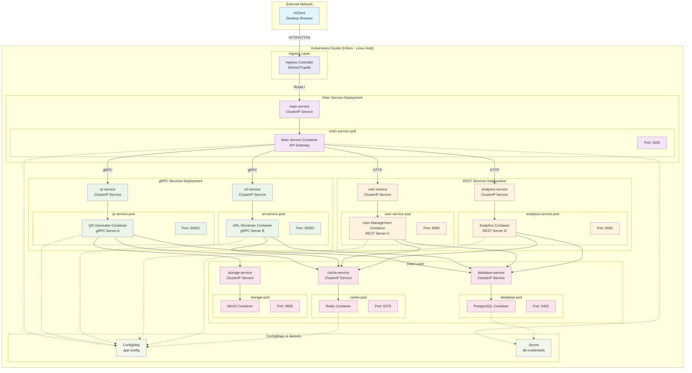

# Kubernetes Deployment Architecture



## Kubernetes Resources

### Namespaces
- **default**: Main application components
- **monitoring**: Observability stack (optional)

### Deployments
- **main-service**: 2 replicas, rolling updates
- **qr-service**: 3 replicas, auto-scaling enabled
- **url-service**: 3 replicas, auto-scaling enabled
- **user-service**: 2 replicas, rolling updates
- **analytics-service**: 2 replicas, rolling updates
- **database**: 1 replica, persistent volume
- **cache**: 1 replica, ephemeral storage
- **storage**: 1 replica, persistent volume

### Services
- **ClusterIP**: Internal service-to-service communication
- **NodePort**: External access during development
- **LoadBalancer**: Production external access

### Network Policies
- **External Network**: HTTP/HTTPS from clients
- **Internal Network**: gRPC (HTTP/2) and REST (HTTP/1.1)
- **Data Network**: Database and cache connections

## Container Specifications

### Main Service Container
```yaml
image: main-service:latest
ports:
  - containerPort: 3000
resources:
  requests:
    memory: "256Mi"
    cpu: "250m"
  limits:
    memory: "512Mi"
    cpu: "500m"
```

### gRPC Service Containers
```yaml
# QR Service
image: qr-service:latest
ports:
  - containerPort: 50051
resources:
  requests:
    memory: "128Mi"
    cpu: "100m"
  limits:
    memory: "256Mi"
    cpu: "200m"

# URL Service
image: url-service:latest
ports:
  - containerPort: 50052
resources:
  requests:
    memory: "128Mi"
    cpu: "100m"
  limits:
    memory: "256Mi"
    cpu: "200m"
```

### REST Service Containers
```yaml
# User Service
image: user-service:latest
ports:
  - containerPort: 8080
resources:
  requests:
    memory: "256Mi"
    cpu: "200m"
  limits:
    memory: "512Mi"
    cpu: "400m"

# Analytics Service
image: analytics-service:latest
ports:
  - containerPort: 8081
resources:
  requests:
    memory: "512Mi"
    cpu: "300m"
  limits:
    memory: "1Gi"
    cpu: "600m"
```