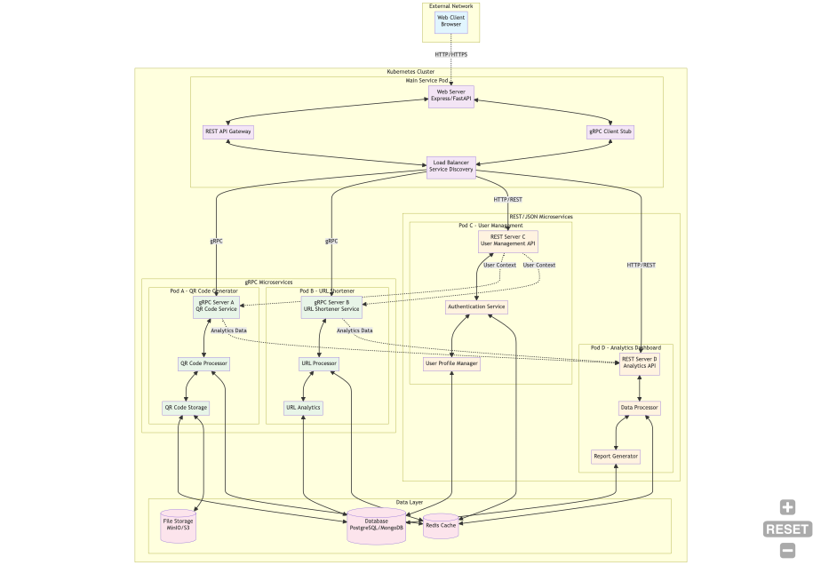
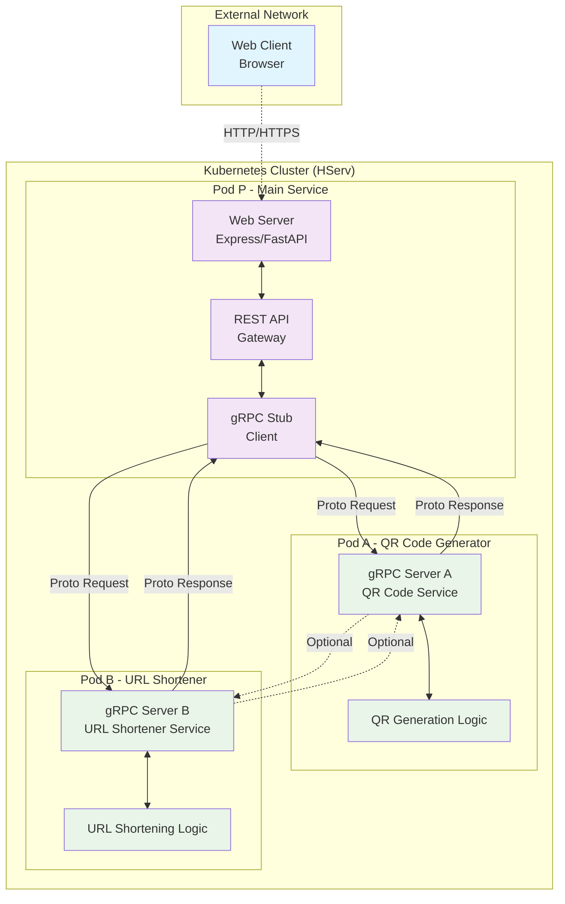

# Main Architecture - Original PDF Requirements

## Architecture Components

### Module P (Main Service)
- **Web Server**: Handles HTTP requests from browsers
- **REST API Gateway**: Translates REST requests to gRPC calls
- **gRPC Stub**: Client that communicates with microservices A and B

### Module A (QR Code Generator)
- **gRPC Server A**: Provides QR code generation services
- **QR Generation Logic**: Core business logic for QR code creation

### Module B (URL Shortener)
- **gRPC Server B**: Provides URL shortening services
- **URL Shortening Logic**: Core business logic for URL management

## Communication Patterns
- **External**: HTTP/HTTPS from web clients
- **Internal**: gRPC over HTTP/2 between services
- **Optional**: Inter-service gRPC communication between A and B