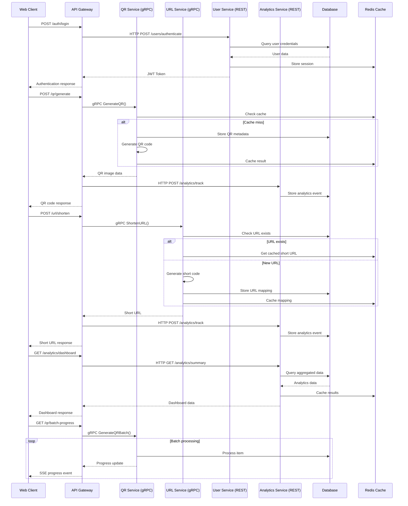
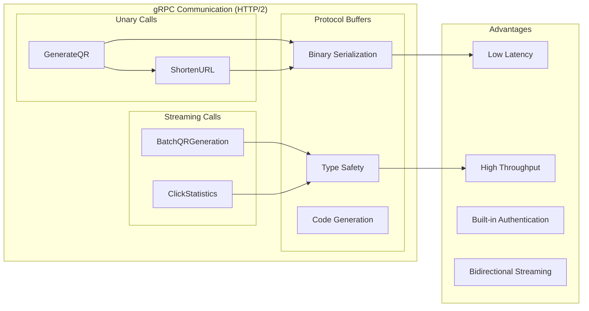
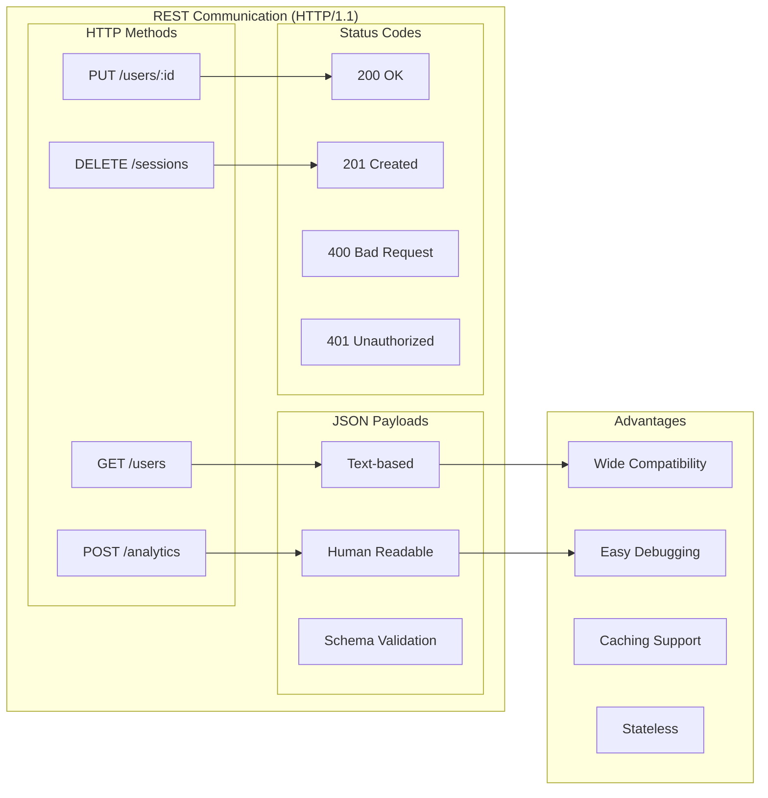
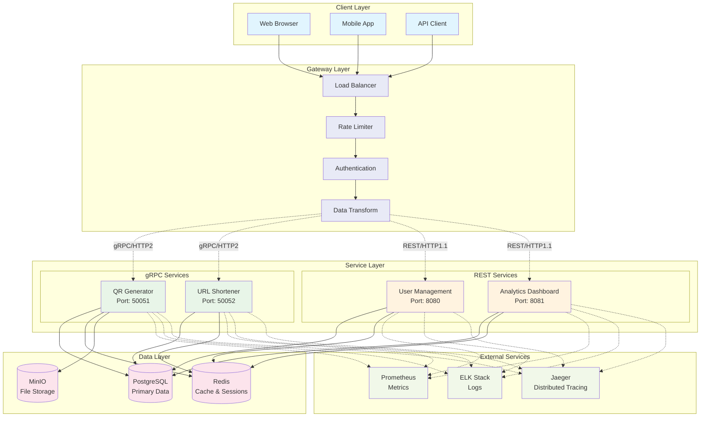
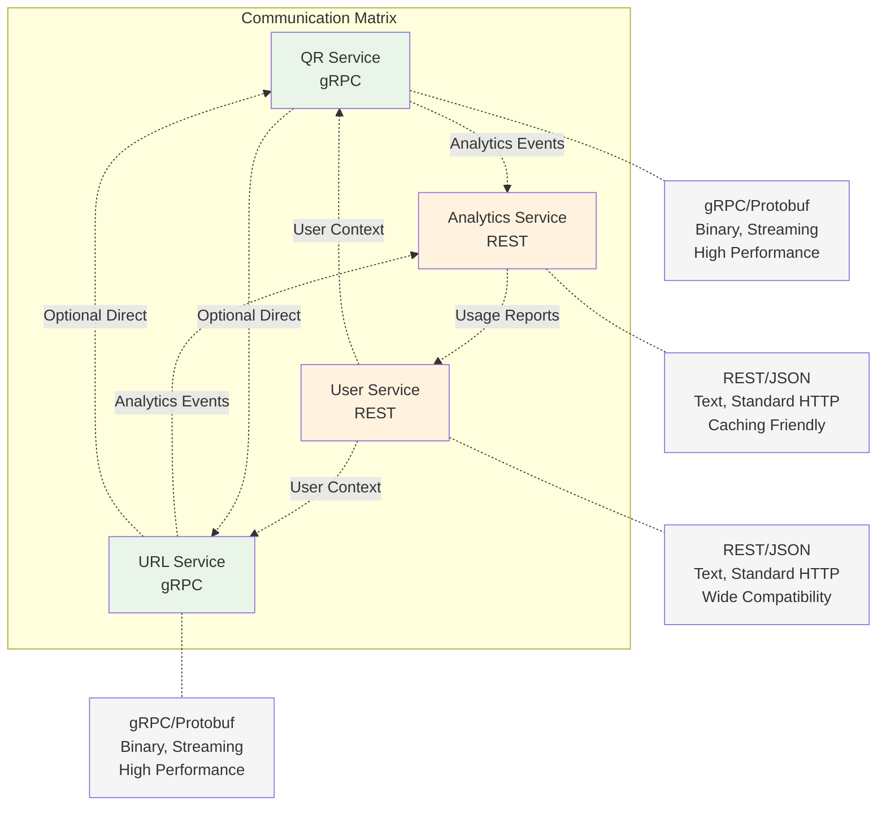

# System Interactions and Data Flow

## Complete System Interaction Flow

## Service Communication Patterns

### gRPC Service Communication

### REST Service Communication

## Data Flow Architecture

## Performance Comparison Matrix

| Aspect | gRPC Services | REST Services |
|--------|---------------|---------------|
| **Protocol** | HTTP/2, Binary | HTTP/1.1, Text |
| **Serialization** | Protocol Buffers | JSON |
| **Performance** | High throughput, Low latency | Moderate performance |
| **Streaming** | Native support | Limited (SSE, WebSocket) |
| **Browser Support** | Requires gRPC-Web | Native |
| **Debugging** | Binary format (tools needed) | Human readable |
| **Schema Evolution** | Backward/Forward compatible | Manual versioning |
| **Code Generation** | Multi-language support | Manual client creation |

## Service Communication Matrix

